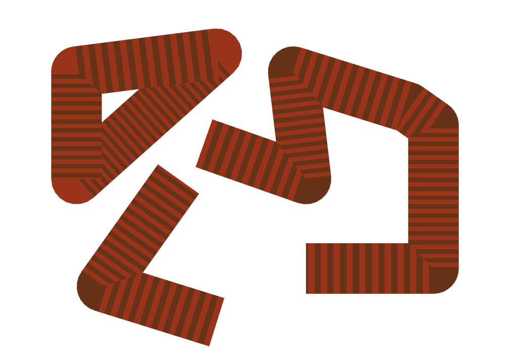
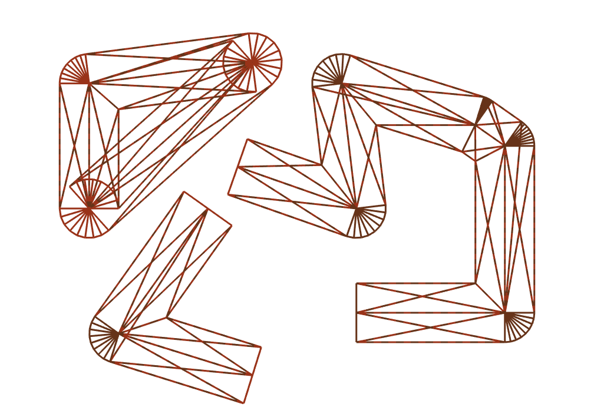
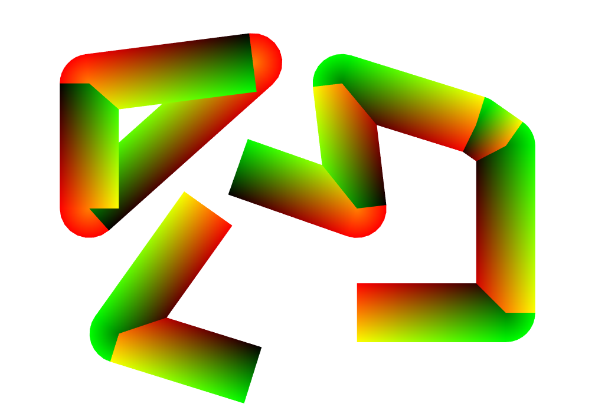
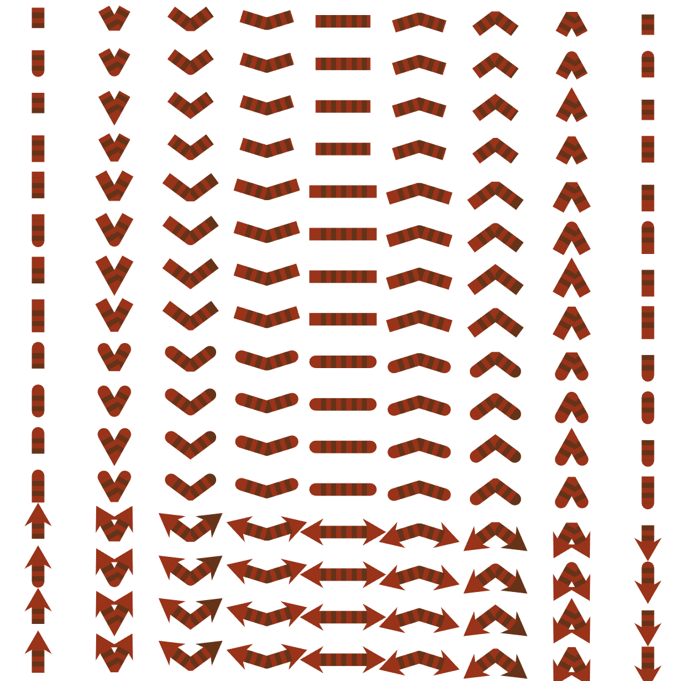

# Instanced Lines for REGL

## Highly extendable instanced line rendering in a single draw call.
Based on [Regl](https://github.com/regl-project/regl).

Loosely based on Rye Terrell's [Instanced Line Rendering](https://wwwtyro.net/2019/11/18/instanced-lines.html), highly recommended as introduction.

[Live demo](https://observablehq.com/@deluksic/regl-insta-lines-example)

## Installation
```bash
npm install --save regl-insta-lines
# or
yarn add regl-insta-lines
```

## Features:
- batch rendering of lines
- vertex shader expanded
- start / end caps (`butt`, `square`, `round`, `arrow(size, angle)`)
- joins (`bevel`, `miter(limit)`, `miterSquare`, `round`)
- GLSL injectable to tailor to your needs (e.g. do you have a non-linear camera?)
- full type support

| filled | wireframe |
|-|-|
|  |  |

| UVs | Decoration using UV.y |
|-|-|
|  |  |

## API

### Example usage:
```typescript
import createRegl from 'regl';
import { createLines, CapType, JoinType } from 'regl-insta-lines';

const regl = createRegl();

// create lines
const lines = createLines(regl, {
  // points can be specified using 2 or 3 floats, typescript will help you enforce this
  dimension: 2,
  width: 60,  // in pixels
  cap: CapType.square,
  join: JoinType.miter(2),  // specify limit here
  joinCount: 3,
  cameraTransform: glsl`
    // optional
    vec4 cameraTransform(vec4 pos) {
      return ... your cool non-linear camera
    }
  `,
  ... other props
});

// describe a batch of lines
lines.setLines([{
  // if dimension=2
  points: [[0, 0], [1, 0], [1, 1]],
  // if dimension=3
  points: [[0, 0, 0], [1, 0, 0], [1, 1, 0]],
  // each line in the batch can be closed or open
  closed: true
}, {
  ...
}]);


// render them
regl.frame(()=>{
  // set width each frame
  lines.setWidth(30 * Math.sin(ctx.time))  // in pixels
  // single draw call rendering
  lines.render();
})
```
### Constructor:
| Property | Type | Default | Description |
|----------|------|---------|-------------|
| width | `number` | `1.0` | Width of lines in pixels. Can also be set using `.setWidth(width)` function after creation. |
| cap | `string` (GLSL) or `{ start: GLSL; end: GLSL; }` | `CapType.butt` | Any of `CapType`s or your own custom GLSL function. Supported: `butt`, `square`, `round` |
| join | `string` (GLSL) | `JoinType.bevel` | Any of `JoinType`s or your own custom GLSL function. Supported: `bevel`, `miter`, `round`, `miterSquare` |
| joinCount | `int` | `4` | Number of triangles approximating the joins. NOTE: joins (like miter or round) effectively become bevel joins when set to 1. |
| distanceFn | `(a: vec3, b: vec3) => number` | `vec3.distance` | Function that calculates distance between two points. Used to determine `distanceAlongPath` varying for fragment shader (useful for dashes for example) |
| frag | `string` (GLSL) | fill white | Optional fragment shader, gets the following varyings: `vec3 vPos; vec2 vUv; vec3 distanceAlongPath;`. NOTE: Even though it's optional here, if you don't specify it, you must wrap the render call inside a regl command that does provide it, otherwise regl will scream at you. |
| reverseMiterLimit | `number` | `0.5` | How far up the segment can a reverse miter go. Anything more than `0.5` runs a risk of failure, but allows sharper angles to still be reverse mitered. |
| cameraTransformGLSL | `string` (GLSL) | identity | Optional GLSL code for a function of the following definition: `vec4 cameraTransform(vec4 pos);` |
| declarationsGLSL | `string` (GLSL) | identity | Optional GLSL declarations code. At least `vec4 cameraTransform(vec4 pos);`. Useful for custom attributes. |
| defineVerticesGLSL | `string` (GLSL) | `undefined` | Optional GLSL code that defines vertices `vec3 p0, p1, p2, p3;`, or skips a segment by setting `float skip;` to something other than `0.0`  |
| postprocessVerticesGLSL | `string` (GLSL) | `undefined` | Optional GLSL code that modifies clip or screen-space coordinates. |
| mainEndGLSL | `string` (GLSL) | `undefined` | Optional GLSL code that runs at the end of main body. |
| primitive | regl's primitive type | `triangles` | Used for debug when rendering with `lines` for example |

## Extending the base
The main function `createLines` is actually a wrapper around the base implementation `createLineBase` that provides convenience around batch rendering and distance calculation. If you would like to manage your own attribute buffers, you can use `createLineBase` function directly. In this case, you can use `createLines` as a reference implementation since describing how to use it here is a bit verbose, but the interface is very close to what is described in the API section.

## Future Improvements
- provide a few useful fragment shaders (e.g. dashes). Until then, check out the ones in [Live demo](https://observablehq.com/@deluksic/regl-insta-lines-example).

## Combination Test



NOTE: "extra" lines are simply an artifact of rendering with `'line strip'`. In reality each segment is represented as 4 triangles + 2 join accordions, one on each side. Even though each segment renders an accordion on both sides, only one is visible per join because the other one gets back-face culled.

## Anatomy of a single segment

You can view this at [Geogebra](https://www.geogebra.org/geometry/uw5kurzg)


